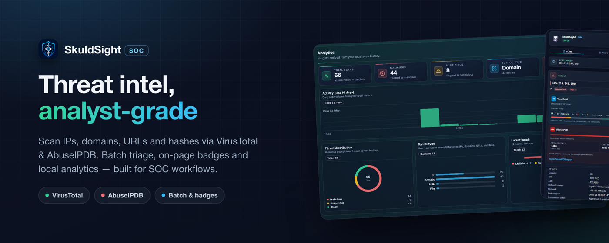
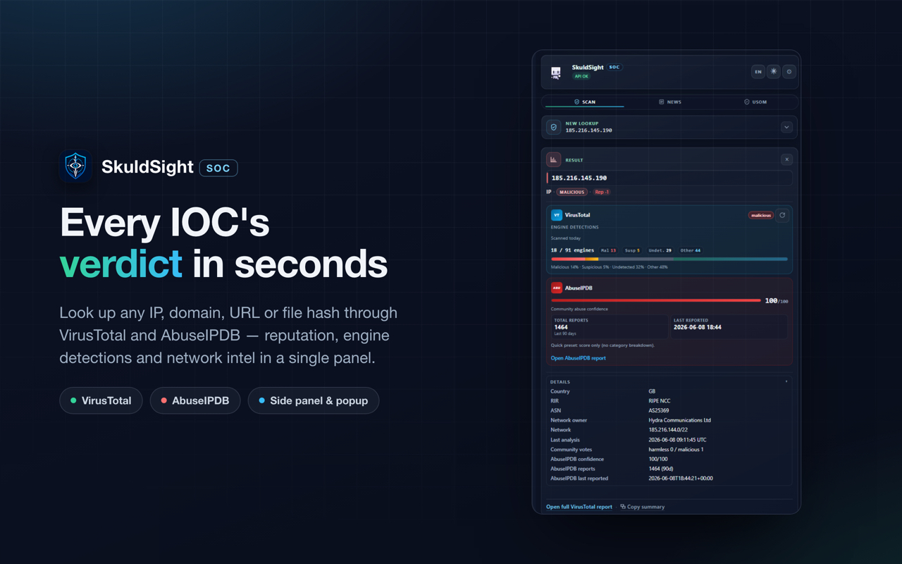
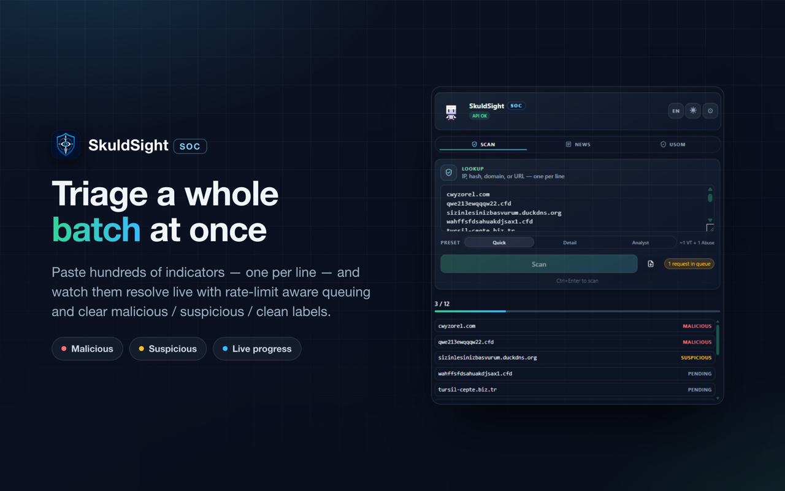
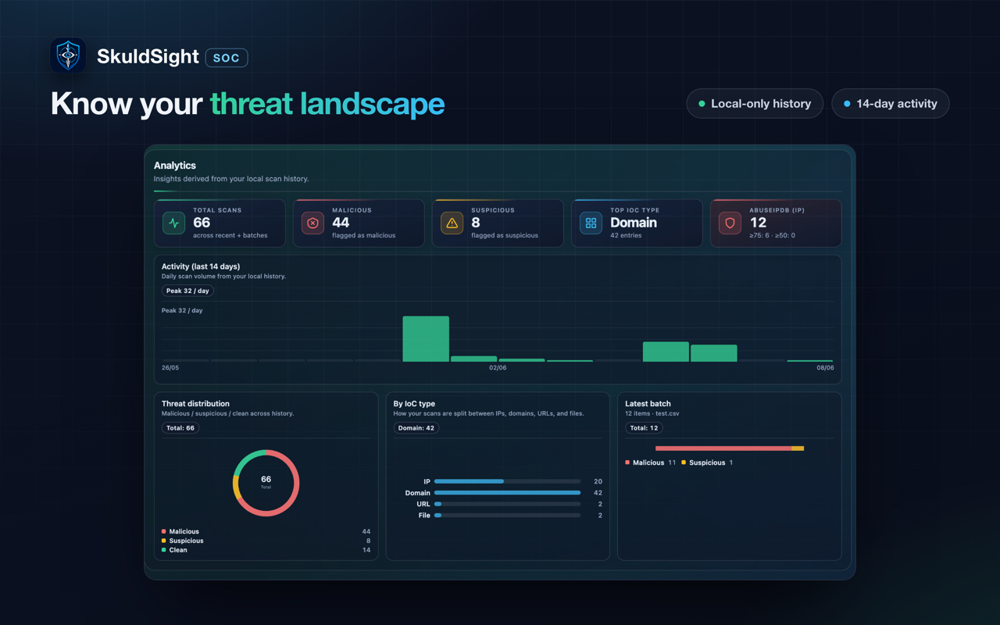
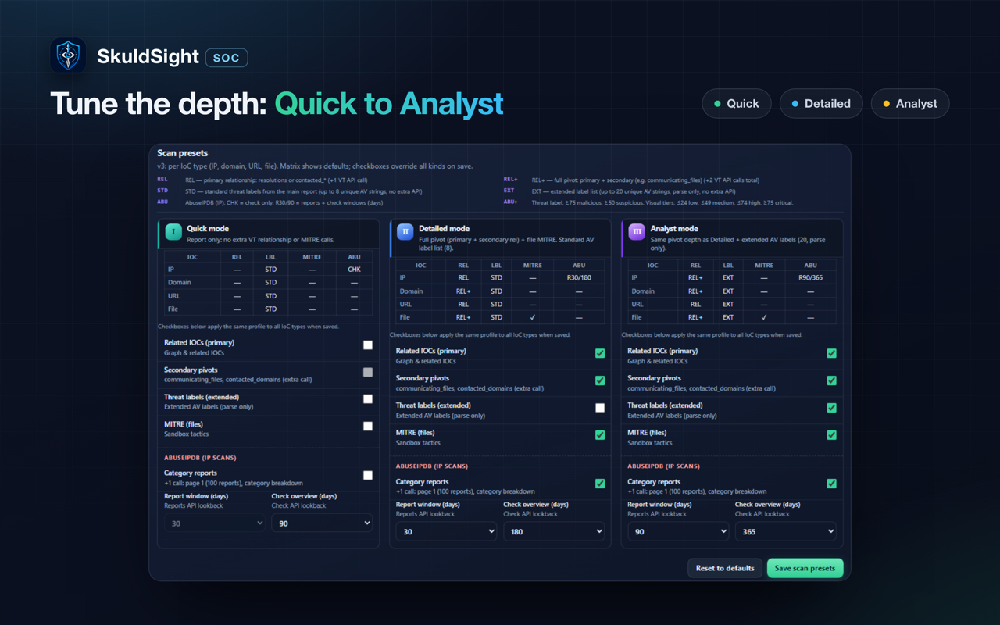
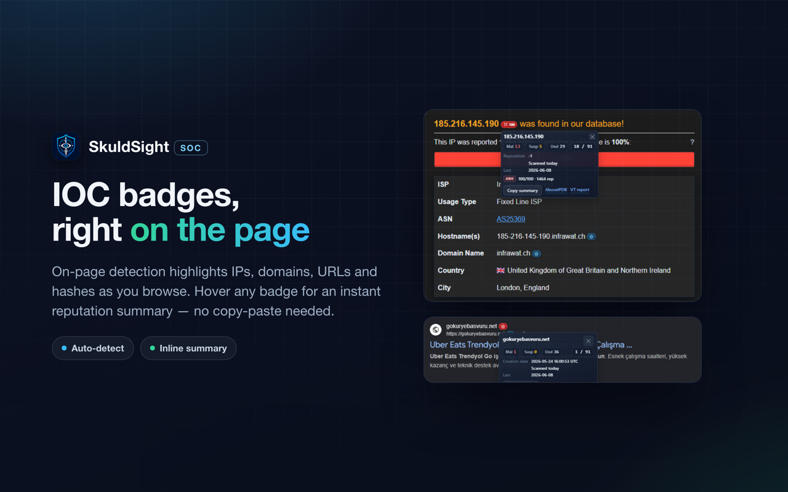

<div align="center">


<br /><br />


# SkuldSight SOC

**Chrome MV3 extension for SOC analysts** — scan IPs, domains, URLs & hashes via VirusTotal, with optional AbuseIPDB, batch scans, and on-page IoC badges.

<p>
  <a href="https://chromewebstore.google.com/detail/skuldsight-soc/mjdpoecgbpenpkadhnkkogifbmmfkjnn">
    
  </a>
  <a href="https://chromewebstore.google.com/detail/skuldsight-soc/mjdpoecgbpenpkadhnkkogifbmmfkjnn">
    
  </a>
  <a href="https://chromewebstore.google.com/detail/skuldsight-soc/mjdpoecgbpenpkadhnkkogifbmmfkjnn">
    
  </a>
  <a href="https://chromewebstore.google.com/detail/skuldsight-soc/mjdpoecgbpenpkadhnkkogifbmmfkjnn">
    
  </a>
</p>

<p>
  <a href="https://chromewebstore.google.com/detail/skuldsight-soc/mjdpoecgbpenpkadhnkkogifbmmfkjnn">
    
  </a>
</p>

<p>
  <a href="#installation">Install</a> ·
  <a href="#features">Features</a> ·
  <a href="#screenshots">Screenshots</a> ·
  <a href="#for-developers">For Developers</a> ·
  <a href="#configuration">Configuration</a> ·
  <a href="#security">Security</a> ·
  <a href="#changelog">Changelog</a>
</p>

</div>

---

## Table of Contents

- [About](#about)
- [Screenshots](#screenshots)
- [Features](#features)
- [Installation](#installation)
- [For Developers](#for-developers)
- [Configuration](#configuration)
- [Security](#security)
- [Changelog](#changelog)

## About

SkuldSight SOC is a Chrome extension built for Security Operations Center (SOC) teams and threat researchers. Query suspicious IPs, domains, URLs, and file hashes without leaving the browser — consolidating daily incident response and IoC validation in one tool.

> API keys are stored locally in your browser only. Scans go directly to VirusTotal and AbuseIPDB. Private and reserved IPs are blocked before outbound requests.

## Screenshots

<div align="center">



**Single IoC scan** — toolbar popup or side panel; instant VirusTotal results with optional AbuseIPDB enrichment for IPs.

<br /><br />



**Batch scan** — paste multiple IoCs from incident logs and process them in bulk.

<br /><br />



**Analytics dashboard** — scan history, trends, and usage metrics in Settings.

<br /><br />



**Scan presets** — Quick, Detailed, and Analyst modes tailored to your workflow.

<br /><br />



**On-page IoC badges** — auto-detect IPs, domains, URLs, and hashes on HTTPS pages; scan with one click.

</div>

## Features

| Feature | Description |
|---------|-------------|
| Single & batch scans | IP, domain, URL, and file hash lookups from popup or side panel |
| On-page badges | Auto-detect IoCs on HTTPS pages; inline scan without leaving the tab |
| Context-menu scan | Right-click selected text to scan from any page |
| Scan presets | Quick / Detailed / Analyst modes for different investigation depths |
| VirusTotal reanalyze | Trigger a fresh VT analysis directly from the result card |
| AbuseIPDB enrichment | Optional IP reputation scores alongside VirusTotal |
| Side panel | Persistent scan UI alongside your browser tabs |
| Threat intel feeds | Security news (RSS) and USOM alerts with auto-refresh and notifications |
| Scan history & analytics | Local history and usage dashboard in Settings |
| English & Turkish UI | Full interface localization for both languages |
| Private IP blocking | Reserved and private IP ranges blocked before outbound API calls |

## Installation

### For users (recommended)

1. Open the [Chrome Web Store listing](https://chromewebstore.google.com/detail/skuldsight-soc/mjdpoecgbpenpkadhnkkogifbmmfkjnn) and click **Add to Chrome**
2. Open **Settings** and add your VirusTotal API key (AbuseIPDB key optional for IP enrichment)
3. Scan from the toolbar popup, side panel, context menu, or on-page badges

### For developers

No build step — load unpacked from the repo root:

1. Open `chrome://extensions` and enable **Developer mode**
2. Click **Load unpacked** and select this project folder

## For Developers

No bundler, no ES modules — all scripts share one global namespace (`VtSocUtils`, `t` / `applyI18n`, etc.). Load order in HTML, `importScripts`, or `manifest.json` **is** the dependency graph.

<details>
<summary><strong>Project structure</strong></summary>

```text
manifest.json            Entry point: paths, permissions, content scripts, CSP
assets/                  icons/ (toolbar + store) and pixel/ (mascot sprites)
store/                   Chrome Web Store promo images and screenshots
styles/                  tokens.css + base.css (shared) and popup/, options/ parts
src/
  shared/                Cross-surface code
    utils/               VtSocUtils namespace, split by domain (core, analytics,
                         summary, presets, ioc)
    i18n.js
  background/            Service worker; background.js orchestrates importScripts
                         of config, settings-uimode, feeds, vt-client, vt-parse,
                         abuse, scan, analytics, messaging
  popup/                 popup.html + state/ui-helpers/feeds/result/scan parts
  options/               options.html + state/settings/analytics/init parts
  content/               content-utils.js + detect/panel/scan/observe parts
docs/                    SECURITY_HARDENING_CHECKLIST.md
```

</details>

<details>
<summary><strong>Load order matters</strong></summary>

Because there is no module system, every file shares one global scope and the **load order acts as the import graph**. Shared/namespace files must load before their consumers:

- HTML pages: the `<script>` order in `popup.html` / `options.html` (`shared/utils/*` → `i18n.js` → page parts; page entry/init parts load last).
- Service worker: the `importScripts(...)` order in `background/background.js` (config/state first, `messaging.js` listeners last).
- Content scripts: the `content_scripts.js` array order in `manifest.json`.

When adding a file, register it in the correct place above and respect the order.

</details>

## Configuration

In **Settings**:

| Key | Required | Purpose |
|-----|----------|---------|
| VirusTotal API | Yes | All scans |
| AbuseIPDB API | No | IP enrichment only |

Keys are stored in `chrome.storage.local` only (14-day TTL). Rotate API keys periodically; expired keys are cleared automatically.

## Security

See [`docs/SECURITY_HARDENING_CHECKLIST.md`](docs/SECURITY_HARDENING_CHECKLIST.md) before release.

## Changelog

Release history and version notes: [`CHANGELOG.md`](CHANGELOG.md).
