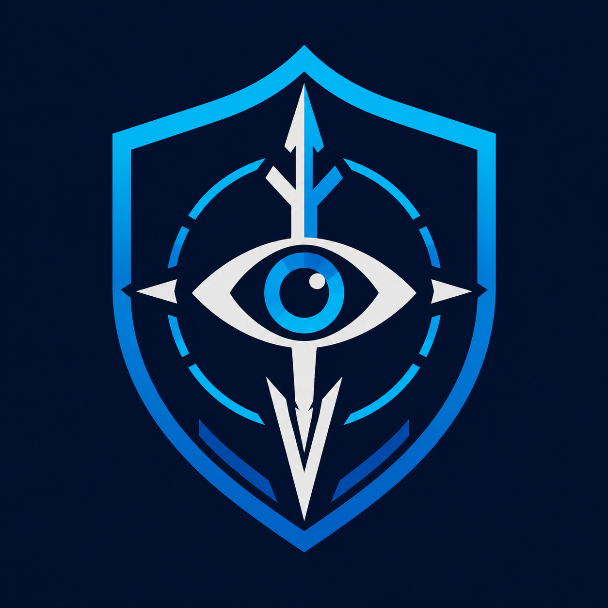

<div align="center">



# SkuldSight SOC

**Threat intel, analyst-grade — right in your browser.**

Scan IPs, domains, URLs and file hashes via VirusTotal and AbuseIPDB, run batch triage, and get on-page IOC badges. Built for SOC workflows. No build step, no telemetry.

[](https://chromewebstore.google.com/detail/skuldsight-soc/mjdpoecgbpenpkadhnkkogifbmmfkjnn)


<a href="https://chromewebstore.google.com/detail/skuldsight-soc/mjdpoecgbpenpkadhnkkogifbmmfkjnn">
  
</a>

[Features](#-features) · [Screenshots](#-screenshots) · [Install](#-install) · [Configuration](#-configuration) · [Project structure](#-project-structure) · [Security](#-security)

</div>

<div align="center">


</div>

---

## 💡 Why SkuldSight

> SOC analysts validate dozens of indicators a day — copy a hash, open a tab, paste, repeat. SkuldSight collapses that loop into one place: lookups, batch triage, and on-page badges, with VirusTotal engine results and optional AbuseIPDB enrichment, all without leaving the page you're investigating.

- **One-click IoC lookup** from the toolbar popup or the side panel.
- **Direct-to-source** — scans go straight to VirusTotal / AbuseIPDB; API keys live in your browser only.
- **SOC-tuned** — Quick / Detailed / Analyst presets, reanalyze, scan history, and a local analytics dashboard.

---

## ✨ Features

| Capability | What it does |
|---|---|
| 🔍 **Single scan** | Look up any IP, domain, URL, or file hash — reputation, engine detections, and network intel in one panel. |
| 📦 **Batch scan** | Paste hundreds of indicators (one per line); rate-limit-aware queue resolves them live with malicious / suspicious / clean labels. |
| 🏷️ **On-page badges** | Auto-detect IPs, domains, URLs, and hashes on HTTPS pages; hover any badge for an instant reputation summary. |
| ⚙️ **Scan presets** | Quick / Detailed / Analyst depth control — tune VT pivots, threat labels, MITRE, and AbuseIPDB windows. |
| 📊 **Analytics** | Local-only dashboard: totals, 14-day activity, threat distribution, and IoC-type breakdown. |
| 🔄 **Reanalyze** | Trigger a fresh VirusTotal analysis straight from the result card. |
| 🛡️ **AbuseIPDB enrichment** | Optional confidence score, report counts, and category breakdown for IP indicators. |
| 🌐 **Bilingual UI** | Full English and Turkish interface. |

---

## 📸 Screenshots

<div align="center">

| Single scan | Batch triage |
|:---:|:---:|
|  |  |
| **Analytics dashboard** | **On-page IOC badges** |
|  |  |

</div>

<details>
<summary><b>More — scan presets (Quick → Analyst)</b></summary>

<br />

<div align="center">


</div>

</details>

---

## 🚀 Install

### From the Chrome Web Store (recommended)

**[Add to Chrome →](https://chromewebstore.google.com/detail/skuldsight-soc/mjdpoecgbpenpkadhnkkogifbmmfkjnn)**

### From source (development)

```text
1. Open chrome://extensions
2. Enable Developer mode
3. Click "Load unpacked" and select this project folder
```

> [!NOTE]
> This is a Manifest V3 extension with **no build step** — load the repo root directly. No npm install, no bundler.

---

## 🔧 Configuration

Open **Settings** and add your API keys:

| Key | Required | Purpose |
|-----|----------|---------|
| VirusTotal API | ✅ Yes | All scans |
| AbuseIPDB API | ⬜ No | IP enrichment only |

> [!IMPORTANT]
> Keys are stored in `chrome.storage.local` only (14-day TTL) and are never logged or transmitted anywhere except VirusTotal / AbuseIPDB. Private/reserved IPs are blocked before any outbound request. Rotate keys periodically — expired keys are cleared automatically.

---

## 🏗️ Project structure

No build step — the extension is loaded unpacked and all scripts run in a shared global namespace (no ES modules / bundler).

```text
manifest.json            Entry point: paths, permissions, content scripts, CSP
assets/                  icons/ (toolbar + store) and pixel/ (mascot sprites)
styles/                  tokens.css + base.css (shared) and popup/, options/ parts
src/
  shared/                Cross-surface code
    utils/               VtSocUtils namespace, split by domain (core, analytics,
                         summary, presets, ioc)
    i18n.js
  background/            Service worker; background.js orchestrates importScripts
                         of config, settings-uimode, feeds, vt-client, vt-parse,
                         abuse, scan, analytics, messaging
  popup/                 popup.html + state/ui-helpers/feeds/result/scan parts
  options/               options.html + state/settings/analytics/init parts
  content/               content-utils.js + detect/panel/scan/observe parts
docs/                    SECURITY_HARDENING_CHECKLIST.md
```

<details>
<summary><b>Load order matters</b></summary>

<br />

Because there is no module system, every file shares one global scope and the
**load order acts as the import graph**. Shared/namespace files must load before
their consumers:

- HTML pages: the `<script>` order in `popup.html` / `options.html`
  (`shared/utils/*` → `i18n.js` → page parts; page entry/init parts load last).
- Service worker: the `importScripts(...)` order in `background/background.js`
  (config/state first, `messaging.js` listeners last).
- Content scripts: the `content_scripts.js` array order in `manifest.json`.

When adding a file, register it in the correct place above and respect the order.

</details>

---

## 🔒 Security

API keys never leave local storage, private/reserved IPs are blocked before outbound calls, and the extension ships a tightened CSP. See [`docs/SECURITY_HARDENING_CHECKLIST.md`](docs/SECURITY_HARDENING_CHECKLIST.md) before release.

## 📜 Changelog

Release history and version notes: [`CHANGELOG.md`](CHANGELOG.md).
